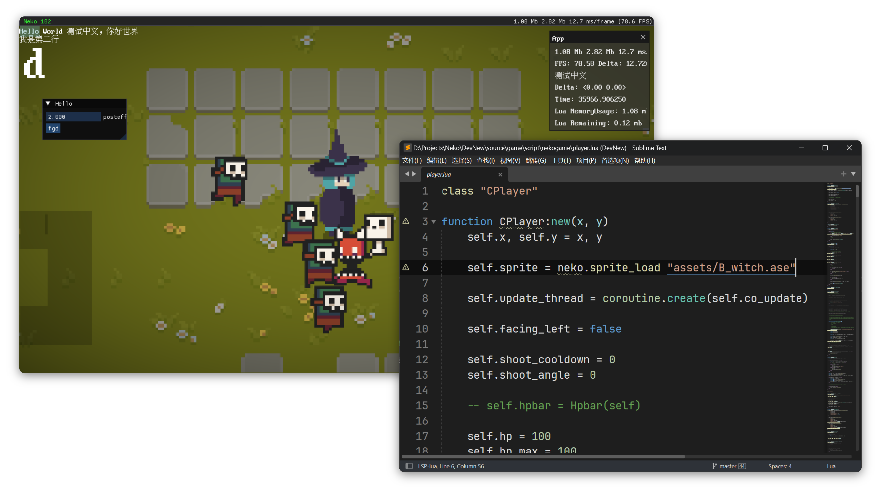

# neko_game_engine

A 2D game framework and utilities written in C++ / Lua

NOTE: This is a "learn by doing" side project that I developed in my free time. I share the code with anyone who might be interested in love2d-like game engine development.

Building
---

premake + msvc should make it easy to set up neko. 
Dependencies are builtin in source/extern/. Just run premake from the repository root,

    premake5 embed (optional, for embeding builtin lua code)
    premake5 luaot (optional, for embeding builtin lua code with Lua AOT)
    premake5 vs2022

So far, this project has only been developed on the Windows platform. Although *Unix support is provided in some modules, it is still mainly based on the Windows platform. However, the difficulty of porting to *Unix is ​​not significant.

Feature
---

Basic playable gameplay system (including animation/basic screen effects/physical collision/simple network/TiledMap markers)

Complete C++/Lua bindings (with Enum and Struct fields and operators)

Hot resource loading (including LuaRef/Image/Sprite/TileMap/Shader)

Basic Tiled map parsing and object logic processing (WIP)

ECS module based on C++/Lua (lua ecs with C data processing)

Dependencies & Code used
---

[GLFW](http://www.glfw.org/),
[GLAD](http://glew.sourceforge.net/),
[Box2d](https://github.com/erincatto/box2d/),
[FMOD](https://www.fmod.com/),
[stb](https://github.com/nothings/stb/),
[imgui](https://github.com/ocornut/imgui/),
[lua-aot-5.4](https://github.com/hugomg/lua-aot-5.4/),
[luasocket](https://lunarmodules.github.io/luasocket/),
[miniz](https://github.com/richgel999/miniz/),
[sokol_time](https://github.com/floooh/sokol/blob/master/sokol_time.h/),
[lovr-http](https://github.com/bjornbytes/lovr-http/),
are used as is without modification

Some code in 
[microui](https://github.com/rxi/microui/),
[love2d](https://love2d.org/),
[spry](https://github.com/jasonliang-dev/spry/),
[cgame](https://github.com/nikki93/cgame/),
[cute_headers](https://github.com/RandyGaul/cute_headers/),
[ant](https://github.com/ejoy/ant/),
is used or referenced with modification

